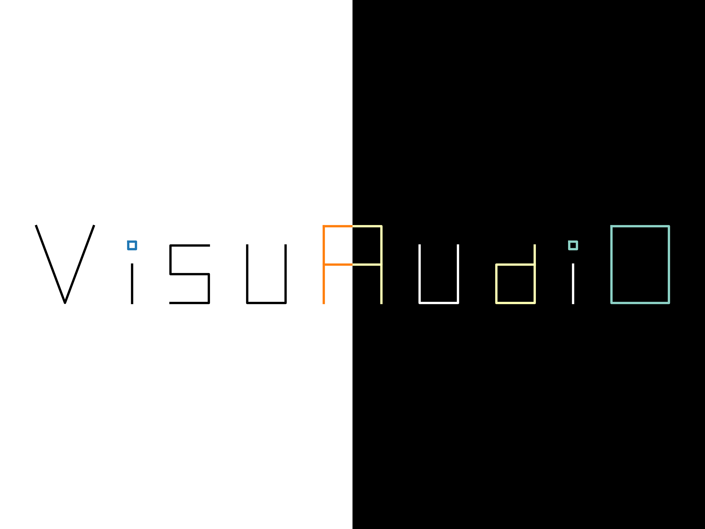
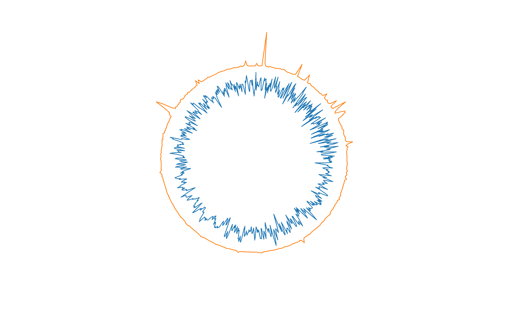
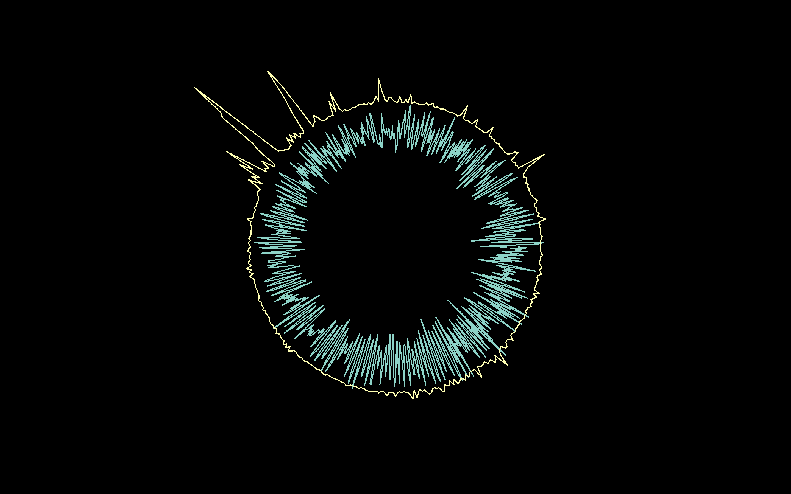

<!-- Improved compatibility of back to top link: See: https://github.com/othneildrew/Best-README-Template/pull/73 -->
<a name="readme-top"></a>
<!--
*** Thanks for checking out the Best-README-Template. If you have a suggestion
*** that would make this better, please fork the repo and create a pull request
*** or simply open an issue with the tag "enhancement".
*** Don't forget to give the project a star!
*** Thanks again! Now go create something AMAZING! :D
-->


<!-- PROJECT SHIELDS -->
<!--
*** I'm using markdown "reference style" links for readability.
*** Reference links are enclosed in brackets [ ] instead of parentheses ( ).
*** See the bottom of this document for the declaration of the reference variables
*** for contributors-url, forks-url, etc. This is an optional, concise syntax you may use.
*** https://www.markdownguide.org/basic-syntax/#reference-style-links
-->
[![Contributors][contributors-shield]][contributors-url]
[![Forks][forks-shield]][forks-url]
[![Stargazers][stars-shield]][stars-url]
[![Issues][issues-shield]][issues-url]
[![MIT License][license-shield]][license-url]


<!-- PROJECT LOGO -->
<br />
<div align="center">
  <a href="https://github.com/yoshiysoh/visuaudio">
    
  </a>

<h3 align="center">VisuAudiO</h3>
  <p align="center">
  A library for VisuAlizing AudiO in real-time in mathematical/physical way.
<!--
    <br />
    <a href="https://github.com/yoshiysoh/visuaudio"><strong>Explore the docs</strong></a>
    <br />
    <br />
    <a href="https://github.com/yoshiysoh/visuaudio">View Demo</a>
    |
    <a href="https://github.com/yoshiysoh/visuaudio/issues">Report Bug</a>
    |
    <a href="https://github.com/yoshiysoh/visuaudio/issues">Request Feature</a>
-->
  </p>
</div>


<!-- TABLE OF CONTENTS -->
<!--
<details>
  <summary>Table of Contents</summary>
  <ol>
    <li>
      <a href="#about-the-project">About The Project</a>
      <ul>
        <li><a href="#built-with">Built With</a></li>
      </ul>
    </li>
    <li>
      <a href="#getting-started">Getting Started</a>
      <ul>
        <li><a href="#prerequisites">Prerequisites</a></li>
        <li><a href="#installation">Installation</a></li>
      </ul>
    </li>
    <li><a href="#usage">Usage</a></li>
    <li><a href="#roadmap">Roadmap</a></li>
    <li><a href="#contributing">Contributing</a></li>
    <li><a href="#license">License</a></li>
    <li><a href="#contact">Contact</a></li>
    <li><a href="#acknowledgments">Acknowledgments</a></li>
  </ol>
</details>
-->


<!-- ABOUT THE PROJECT -->
## About The Project
Real-time audio visualizer/analyzer by Python.

### Gallery
<details> 
<summary>
<i>Audircle & Specirctrogram</i>
</summary>

#### Light background


#### Dark background


#### Description
Inner circle is "Audircle" which visualize the amplitude in circular way.

Outer circle is "Specirctrogram" also visualize the Spectrum in circular way.

</details>


<p align="right">(<a href="#readme-top">back to top</a>)</p>


### Requirements
#### Basics
* Python
* NumPy
* SciPy
* Numba
#### Sound input
* python-sounddevice
#### Visualization
* Matplotlib
* PyQtGraph

<p align="right">(<a href="#readme-top">back to top</a>)</p>


<!-- GETTING STARTED -->
## Getting Started
Here, the explanation is using conda but you can use other method to run this code.

See environment.yml for details of required packages.

### Prerequisites
Environment for Python.

### Example of installation (by conda)

1. Clone the repo
   ```sh
   git clone https://github.com/yoshiysoh/visuaudio.git
   ```
2. Move to the repo
   ```sh
   cd visuaudio
   ```
3. Create new conda environment
   ```sh
   conda env create -f environment.yml
   ```

<p align="right">(<a href="#readme-top">back to top</a>)</p>


<!-- USAGE EXAMPLES -->
## Usage

### Execution (by conda)
1. Activate environment
   ```sh
   conda activate visuaudio
   ```
2. Move to destination
   ```sh
   cd example
   ```
3. Execute the script
   ```sh
   python example.py
   ```

<p align="right">(<a href="#readme-top">back to top</a>)</p>


<!-- ROADMAP -->
## Roadmap

- [ ] Spectrum analysis

See the [open issues](https://github.com/yoshiysoh/visuaudio/issues) for a full list of proposed features (and known issues).

<p align="right">(<a href="#readme-top">back to top</a>)</p>


<!-- CONTRIBUTING -->
## Contributing

Contributions are what make the open source community such an amazing place to learn, inspire, and create. Any contributions you make are **greatly appreciated**.

If you have a suggestion that would make this better, please fork the repo and create a pull request. You can also simply open an issue with the tag "enhancement".
Don't forget to give the project a star! Thanks again!

1. Fork the Project
2. Create your Feature Branch (`git checkout -b feature/AmazingFeature`)
3. Commit your Changes (`git commit -m 'Add some AmazingFeature'`)
4. Push to the Branch (`git push origin feature/AmazingFeature`)
5. Open a Pull Request

<p align="right">(<a href="#readme-top">back to top</a>)</p>


<!-- LICENSE -->
## License

Distributed under the MIT License. See `LICENSE` for more information.

<p align="right">(<a href="#readme-top">back to top</a>)</p>


<!-- CONTACT -->
## Contact

Project Link: [https://github.com/yoshiysoh/visuaudio](https://github.com/yoshiysoh/visuaudio)

<p align="right">(<a href="#readme-top">back to top</a>)</p>


<!-- ACKNOWLEDGMENTS -->
<!--
## Acknowledgments

* []()
* []()
* []()

<p align="right">(<a href="#readme-top">back to top</a>)</p>
-->


<!-- MARKDOWN LINKS & IMAGES -->
<!-- https://www.markdownguide.org/basic-syntax/#reference-style-links -->
[contributors-shield]: https://img.shields.io/github/contributors/yoshiysoh/visuaudio.svg?style=for-the-badge
[contributors-url]: https://github.com/yoshiysoh/visuaudio/graphs/contributors
[forks-shield]: https://img.shields.io/github/forks/yoshiysoh/visuaudio.svg?style=for-the-badge
[forks-url]: https://github.com/yoshiysoh/visuaudio/network/members
[stars-shield]: https://img.shields.io/github/stars/yoshiysoh/visuaudio.svg?style=for-the-badge
[stars-url]: https://github.com/yoshiysoh/visuaudio/stargazers
[issues-shield]: https://img.shields.io/github/issues/yoshiysoh/visuaudio.svg?style=for-the-badge
[issues-url]: https://github.com/yoshiysoh/visuaudio/issues
[license-shield]: https://img.shields.io/github/license/yoshiysoh/visuaudio.svg?style=for-the-badge
[license-url]: https://github.com/yoshiysoh/visuaudio/blob/master/LICENSE
[linkedin-shield]: https://img.shields.io/badge/-LinkedIn-black.svg?style=for-the-badge&logo=linkedin&colorB=555
[linkedin-url]: https://linkedin.com/in/linkedin_username
